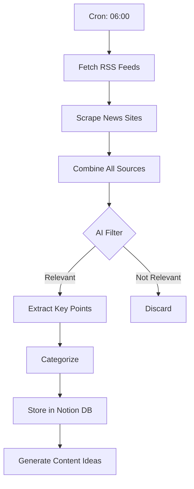

# DAILY RECRUITMENT NEWS → CONTENT MACHINE

## SYSTEEM OVERZICHT

```
┌─────────────────────────────────────────────────────────────────────────┐
│                    RECRUITMENT CONTENT INTELLIGENCE                      │
│                         Daily Automated Pipeline                         │
├─────────────────────────────────────────────────────────────────────────┤
│                                                                          │
│   ┌──────────────┐    ┌──────────────┐    ┌──────────────┐             │
│   │   NEWS       │    │   LABOUR     │    │   OWN        │             │
│   │   SOURCES    │───▶│   MARKET     │───▶│   DATA       │             │
│   │              │    │   MCP        │    │   (Pipedrive)│             │
│   └──────────────┘    └──────────────┘    └──────────────┘             │
│          │                   │                   │                      │
│          └───────────────────┼───────────────────┘                      │
│                              ▼                                          │
│                    ┌──────────────────┐                                 │
│                    │   AI CONTENT     │                                 │
│                    │   GENERATOR      │                                 │
│                    │   (Claude API)   │                                 │
│                    └──────────────────┘                                 │
│                              │                                          │
│          ┌───────────────────┼───────────────────┐                      │
│          ▼                   ▼                   ▼                      │
│   ┌──────────────┐    ┌──────────────┐    ┌──────────────┐             │
│   │  LINKEDIN    │    │   BLOG       │    │  NEWSLETTER  │             │
│   │  POSTS       │    │   ARTICLES   │    │  CONTENT     │             │
│   └──────────────┘    └──────────────┘    └──────────────┘             │
│                                                                          │
└─────────────────────────────────────────────────────────────────────────┘
```

---

## FASE 1: DATA BRONNEN (INPUT)

### 1.1 Recruitment News Sources

| Bron | Type | Frequentie | Method |
|------|------|------------|--------|
| **Werf&** | NL Recruitment News | Dagelijks | RSS + Scrape |
| **RecruitmentTech.nl** | HR Tech News | Dagelijks | RSS |
| **Intelligence Group** | Arbeidsmarkt Data | Wekelijks | API/Scrape |
| **CBS** | Officiële Statistieken | Maandelijks | API |
| **UWV** | Vacature/Werkloosheid | Wekelijks | Scrape |
| **LinkedIn News** | Global Trends | Dagelijks | Scrape |
| **Michael Page/Hays** | Salary Surveys | Kwartaal | Scrape |
| **Indeed Hiring Lab** | Job Market Data | Wekelijks | Scrape |

### 1.2 RSS Feeds (Direct beschikbaar)

```yaml
rss_feeds:
  - name: "Werf&"
    url: "https://www.werf-en.nl/feed/"
    category: "recruitment_nl"
    
  - name: "RecruitmentTech"
    url: "https://recruitmenttech.nl/feed/"
    category: "hr_tech"
    
  - name: "HR Praktijk"
    url: "https://www.hrpraktijk.nl/rss"
    category: "hr_general"
    
  - name: "MT/Sprout"
    url: "https://www.mt.nl/feed/"
    category: "business_nl"
    filter: ["recruitment", "arbeidsmarkt", "talent"]
```

### 1.3 Labour Market MCP Tools

```typescript
// Bestaande MCP tools uit je setup:
tools: [
  "analyze_labour_market_professional",    // Marktanalyse per functie
  "analyze_jobdigger_pdf_specialized",     // JobDigger data processing
  "generate_professional_report"            // Rapport generatie
]

// Nieuwe tools toe te voegen:
new_tools: [
  "fetch_recruitment_news",                 // Dagelijkse news aggregatie
  "analyze_salary_trends",                  // Salary benchmark updates
  "generate_content_suggestions",           // AI content ideeën
  "publish_to_channels"                     // Multi-channel publishing
]
```

### 1.4 Own Data Sources

```yaml
internal_data:
  pipedrive:
    - deals_by_sector        # Welke sectoren zijn hot?
    - time_to_fill_avg       # Eigen metrics
    - salary_negotiations    # Real salary data
    
  jobdigger:
    - vacancy_volume         # Per sector/regio
    - growth_trends          # Week-over-week
    - skill_demand           # Trending skills
    
  website:
    - top_pages              # Waar zoeken mensen naar?
    - search_queries         # Interne zoektermen
    - conversion_data        # Wat werkt?
```

---

## FASE 2: DATA PROCESSING (TRANSFORMATION)

### 2.1 Daily News Aggregation Flow



### 2.2 News Processing Schema

```typescript
interface NewsItem {
  id: string;
  source: string;
  title: string;
  url: string;
  published: Date;
  
  // AI-extracted fields
  summary: string;           // 2-3 zinnen
  key_stats: string[];       // Cijfers/data
  relevance_score: number;   // 0-100
  
  // Content potential
  categories: string[];      // ["salary", "tech", "trends"]
  content_angles: string[];  // Mogelijke invalshoeken
  icp_relevance: string[];   // ["operations_manager", "hr_manager"]
  
  // Output flags
  linkedin_worthy: boolean;
  blog_worthy: boolean;
  newsletter_worthy: boolean;
}
```

### 2.3 AI Processing Prompt

```markdown
## NEWS ANALYSIS PROMPT

Je bent een recruitment content strategist voor Recruitin B.V.

**ICP Context:**
- Target: Operations/Technisch Directeuren, HR Managers
- Bedrijven: 50-800 FTE, Technisch/Productie
- Regio: Oost-Nederland (Gelderland, Overijssel, Noord-Brabant)
- Sectoren: Oil & Gas, Constructie, Productie, Automation, Renewable Energy

**Analyseer dit nieuwsartikel:**
[NEWS_CONTENT]

**Return JSON:**
{
  "summary": "2-3 zinnen samenvatting",
  "key_stats": ["stat 1", "stat 2"],
  "relevance_score": 0-100,
  "content_angles": [
    {
      "angle": "Beschrijving invalshoek",
      "format": "linkedin_post|blog|whitepaper",
      "hook": "Eerste zin/hook",
      "target_persona": "technisch_directeur|hr_manager|founder"
    }
  ],
  "contrarian_take": "Wat zou de 'no-bullshit' mening zijn?",
  "data_to_add": "Welke eigen data zou dit versterken?"
}
```

---

## FASE 3: CONTENT GENERATION (OUTPUT)

### 3.1 Content Types & Templates

#### A) LINKEDIN POST (Dagelijks)

**Trigger:** News item met relevance_score > 70

```markdown
## LINKEDIN NEWS REACT TEMPLATE

**Format:** Contrarian React

[NEWS HOOK - wat zegt het nieuws]

Mijn take:

[CONTRARIAN/EXPERT PERSPECTIEF - 3-4 zinnen]

[EIGEN DATA/ERVARING die dit onderbouwt]

[VRAAG aan publiek]

---

**Voorbeeld:**

"Vacatures dalen met 3,3% volgens CBS."

Mijn take:

Ja, de markt koelt af. Maar niet overal.

In de afgelopen 4 weken plaatsten wij 7 monteurs in Oost-Nederland.
Allemaal binnen 45 dagen. Geen enkele solliciteerde actief.

Het probleem is niet "minder vacatures".
Het probleem is dat 90% van de vacatureteksten nog steeds waardeloos zijn.

Dus ja, minder vacatures. Maar dezelfde 5 bedrijven vechten nog steeds
om dezelfde 100 kandidaten.

Wat zie jij in jouw sector - minder druk of net zo krap als altijd?
```

#### B) BLOG ARTIKEL (Wekelijks)

**Trigger:** 3+ gerelateerde news items OF high-impact single item

```markdown
## BLOG ARTICLE TEMPLATE

# [TITEL: Specifiek + Data + Benefit]
Voorbeeld: "Waarom de 'Afkoelende Arbeidsmarkt' voor Jouw Vacatures Niets Verandert (+ Wat Wél Werkt)"

## Hook (50-100 woorden)
[Nieuwsitem samenvatten + waarom dit relevant is voor ICP]

## Het Grotere Plaatje (200-300 woorden)
[Context, trend analyse, wat betekent dit voor technische bedrijven]

## Wat de Data Niet Vertelt (300-400 woorden)
[Contrarian perspectief, eigen data, nuance toevoegen]
[Include: JobDigger data, Pipedrive metrics, klantvoorbeelden]

## Wat Dit Betekent voor Jouw Recruitment (300-400 woorden)
[Praktische implicaties per ICP persona]
[Actionable insights]

## 5 Dingen Die Je Morgen Kunt Doen (200-300 woorden)
[Concrete actiepunten]

## Conclusie + CTA (100 woorden)
[Samenvatting + next step]

---

**SEO Requirements:**
- Target keyword in titel, H2, eerste 100 woorden
- 1500-2000 woorden
- 3 interne links naar recruitin.nl
- Meta description 150-160 chars
```

#### C) WHITEPAPER/LEAD MAGNET (Maandelijks)

**Trigger:** Quarterly trends OF major market shift

```markdown
## WHITEPAPER TEMPLATE

**Titel Format:** "De [JAAR] [TOPIC] Gids: [Benefit] voor [ICP]"
Voorbeeld: "De 2025 Technische Arbeidsmarkt Gids: Hoe Mid-Market Bedrijven Concurreren met Corporates om Schaars Talent"

**Structuur:**
1. Executive Summary (1 pagina)
2. Marktoverzicht met Data (3-4 pagina's)
   - CBS/UWV officiële cijfers
   - JobDigger vacancy trends
   - Salary benchmarks per rol
3. Sector Deep-Dives (4-5 pagina's)
   - Oil & Gas
   - Constructie/Infra
   - Productie/Manufacturing
   - Automation/Tech
4. Case Studies (2-3 pagina's)
   - Eigen klantvoorbeelden (geanonimiseerd)
5. Actionable Playbook (3-4 pagina's)
6. Over Recruitin + CTA (1 pagina)

**Lead Capture:**
- Gated achter Typeform
- Email sequence na download (3 emails)
- Pipedrive deal creation
```

#### D) NEWSLETTER CONTENT (Wekelijks)

**Onderdeel van:** Tech Talent Insights nieuwsbrief

```markdown
## NEWSLETTER SECTION: "Weekly Market Pulse"

### Template:

📊 **ARBEIDSMARKT DEZE WEEK**

**Headlines:**
• [News item 1 - 1 zin + link]
• [News item 2 - 1 zin + link]
• [News item 3 - 1 zin + link]

**Cijfer van de Week:**
[Opvallende statistiek + wat het betekent]

**Onze Take:**
[2-3 zinnen expert perspectief]

**Quick Win:**
[1 concrete tip die lezer direct kan toepassen]

---

### Automation:
- Trigger: Elke vrijdag 14:00
- Source: Week's processed news items
- Delivery: Resend → Email list
```

---

## FASE 4: AUTOMATION ARCHITECTURE

### 4.1 Zapier Flow Design

```yaml
# FLOW 1: Daily News Collection (06:00)
name: "Daily Recruitment News Aggregator"
trigger:
  type: schedule
  time: "06:00"
  timezone: "Europe/Amsterdam"

actions:
  1_fetch_rss:
    app: "RSS by Zapier"
    feeds: ["werf-en", "recruitmenttech", "hrpraktijk"]
    
  2_scrape_sites:
    app: "Webhooks by Zapier"
    url: "https://api.firecrawl.dev/v0/scrape"
    sites: ["intelligence-group", "cbs-arbeidsmarkt"]
    
  3_ai_process:
    app: "Claude by Zapier"
    prompt: "[NEWS_ANALYSIS_PROMPT]"
    model: "claude-sonnet-4-20250514"
    
  4_store_notion:
    app: "Notion"
    database: "Recruitment News DB"
    properties:
      - title
      - summary
      - relevance_score
      - content_angles
      - source_url
      
  5_filter_high_relevance:
    app: "Filter by Zapier"
    condition: "relevance_score >= 70"
    
  6_slack_alert:
    app: "Slack"
    channel: "#content-ideas"
    message: "📰 Nieuwe content opportunity: {title}"

---

# FLOW 2: Content Generation (08:00)
name: "AI Content Generator"
trigger:
  type: schedule
  time: "08:00"

actions:
  1_get_todays_news:
    app: "Notion"
    filter: "created_today AND linkedin_worthy = true"
    
  2_generate_linkedin:
    app: "Claude by Zapier"
    prompt: "[LINKEDIN_TEMPLATE]"
    context: "{news_items}"
    
  3_generate_variations:
    app: "Claude by Zapier"
    prompt: "Create 3 variations: A) data-focused B) contrarian C) story"
    
  4_store_drafts:
    app: "Notion"
    database: "Content Drafts"
    status: "Ready for Review"
    
  5_notify_team:
    app: "Slack"
    channel: "#marketing"
    message: "📝 {count} LinkedIn posts ready for review"

---

# FLOW 3: Weekly Blog Generator (Maandag 09:00)
name: "Weekly Blog Article Generator"
trigger:
  type: schedule
  time: "09:00"
  day: "Monday"

actions:
  1_get_week_news:
    app: "Notion"
    filter: "last_7_days AND blog_worthy = true"
    
  2_identify_theme:
    app: "Claude by Zapier"
    prompt: "Analyze these news items. What's the overarching theme?"
    
  3_generate_outline:
    app: "Claude by Zapier"
    prompt: "[BLOG_OUTLINE_PROMPT]"
    
  4_generate_draft:
    app: "Claude by Zapier"
    prompt: "[BLOG_FULL_DRAFT_PROMPT]"
    max_tokens: 4000
    
  5_create_google_doc:
    app: "Google Docs"
    title: "DRAFT: {article_title}"
    content: "{draft}"
    
  6_assign_task:
    app: "Notion"
    database: "Content Tasks"
    assignee: "Wouter"
    due_date: "Wednesday"
```

### 4.2 MCP Server Extension

```typescript
// labour-market-intelligence-extended/src/tools/content.ts

export const contentTools = {
  
  // Tool 1: Fetch & Process News
  fetch_recruitment_news: {
    description: "Fetch and process daily recruitment news from multiple sources",
    parameters: {
      sources: ["werf-en", "recruitmenttech", "cbs", "indeed-lab"],
      date_range: "today|week|month",
      categories: ["salary", "trends", "tech", "policy"]
    },
    returns: "NewsItem[]"
  },
  
  // Tool 2: Generate Content Ideas
  generate_content_ideas: {
    description: "Generate content ideas based on news and market data",
    parameters: {
      news_items: "NewsItem[]",
      content_types: ["linkedin", "blog", "whitepaper", "newsletter"],
      icp_focus: ["operations_manager", "hr_manager", "founder"],
      tone: "contrarian|educational|inspirational"
    },
    returns: "ContentIdea[]"
  },
  
  // Tool 3: Create LinkedIn Post
  create_linkedin_post: {
    description: "Generate ready-to-publish LinkedIn post",
    parameters: {
      topic: "string",
      angle: "data_story|contrarian|behind_scenes|how_to",
      include_stats: "boolean",
      max_length: 1300
    },
    returns: {
      post_text: "string",
      hashtags: "string[]",
      best_time: "string",
      engagement_prediction: "number"
    }
  },
  
  // Tool 4: Create Blog Outline
  create_blog_outline: {
    description: "Generate SEO-optimized blog article outline",
    parameters: {
      topic: "string",
      target_keyword: "string",
      word_count: 1500,
      include_data: ["jobdigger", "cbs", "own_metrics"]
    },
    returns: {
      title_options: "string[]",
      outline: "Section[]",
      seo_checklist: "string[]",
      internal_links: "string[]"
    }
  }
}
```

### 4.3 Notion Database Schema

```yaml
# Database: Recruitment News
properties:
  - name: "Title"
    type: "title"
  - name: "Source"
    type: "select"
    options: ["Werf&", "RecruitmentTech", "CBS", "LinkedIn", "Other"]
  - name: "URL"
    type: "url"
  - name: "Published"
    type: "date"
  - name: "Summary"
    type: "rich_text"
  - name: "Key Stats"
    type: "multi_select"
  - name: "Relevance Score"
    type: "number"
  - name: "Categories"
    type: "multi_select"
    options: ["Salary", "Trends", "Tech", "Policy", "Krapte"]
  - name: "Content Angles"
    type: "rich_text"
  - name: "LinkedIn Worthy"
    type: "checkbox"
  - name: "Blog Worthy"
    type: "checkbox"
  - name: "Newsletter Worthy"
    type: "checkbox"
  - name: "Content Created"
    type: "checkbox"
  - name: "Published Content"
    type: "relation"
    relation_to: "Content Library"

---

# Database: Content Library
properties:
  - name: "Title"
    type: "title"
  - name: "Type"
    type: "select"
    options: ["LinkedIn Post", "Blog", "Whitepaper", "Newsletter"]
  - name: "Status"
    type: "select"
    options: ["Idea", "Draft", "Review", "Scheduled", "Published"]
  - name: "Channel"
    type: "multi_select"
    options: ["Personal LinkedIn", "Company LinkedIn", "recruitin.nl", "Newsletter"]
  - name: "Content"
    type: "rich_text"
  - name: "Source News"
    type: "relation"
    relation_to: "Recruitment News"
  - name: "Scheduled Date"
    type: "date"
  - name: "Published Date"
    type: "date"
  - name: "Performance"
    type: "rich_text"
  - name: "Assignee"
    type: "person"
```

---

## FASE 5: IMPLEMENTATION ROADMAP

### Week 1: Foundation

| Dag | Taak | Output |
|-----|------|--------|
| Ma | Setup Notion databases | 2 databases live |
| Di | Configure RSS feeds in Zapier | Flow 1 draft |
| Wo | Build AI processing prompt | Tested prompt |
| Do | Test news aggregation | First auto-run |
| Vr | Review & iterate | Working pipeline |

### Week 2: Content Generation

| Dag | Taak | Output |
|-----|------|--------|
| Ma | LinkedIn template refinement | 4 templates ready |
| Di | Blog template + outline generator | Blog flow working |
| Wo | Connect to publishing (LinkedIn API) | Auto-draft creation |
| Do | Test end-to-end flow | Full pipeline test |
| Vr | Documentation + handoff | Team trained |

### Week 3: Optimization

| Dag | Taak | Output |
|-----|------|--------|
| Ma | Add JobDigger integration | Own data in content |
| Di | Add Pipedrive metrics | Deal data → insights |
| Wo | Newsletter integration | Weekly digest auto |
| Do | Performance tracking setup | Analytics dashboard |
| Vr | First full week review | Iterate based on results |

---

## FASE 6: EXAMPLE OUTPUTS

### Voorbeeld 1: News → LinkedIn Post

**Input (News Item):**
```
Source: CBS
Title: "Vacatures dalen met 3,3% in Q3 2025"
Key stat: "97 vacatures per 100 werklozen"
```

**Output (LinkedIn Post):**
```
"Arbeidsmarkt koelt af" zeggen de headlines.

Ik heb er 47 redenen om dat te betwijfelen.

Dat zijn de technische vacatures die wij de afgelopen 90 dagen
invulden in Oost-Nederland. Gemiddelde time-to-fill: 38 dagen.

Ja, het CBS zegt dat vacatures dalen met 3,3%.
Maar in de techniek? Daar vechten nog steeds 5 bedrijven
om dezelfde 100 monteurs.

Het echte probleem is niet "minder vacatures".
Het probleem is dat de vacatures die overblijven,
door dezelfde slechte teksten worden verkocht.

97 vacatures per 100 werklozen klinkt als "balans".
Maar als 90% van die vacatures niet vindbaar, niet aantrekkelijk,
of niet competitief is... dan is er geen balans. 

Alleen frustratie.

Wat zie jij in jouw sector - echte verlichting of dezelfde strijd?

#recruitment #arbeidsmarkt #techniek
```

### Voorbeeld 2: News → Blog Outline

**Input (Multiple News Items):**
```
1. "Lonen stijgen 5,5% in Q1 2025" - CBS
2. "Skill-based hiring wordt norm" - RecruitmentTech
3. "37% bedrijven worstelt met aannemen" - Michael Page
```

**Output (Blog Outline):**
```markdown
# Waarom Hogere Salarissen Niet Genoeg Zijn om Technisch Talent te Werven in 2025

## 1. De Paradox: Meer Geld, Minder Kandidaten
- CBS: 5,5% salarrisstijging
- Maar: 37% worstelt nog steeds (Michael Page)
- Wat mist er in deze vergelijking?

## 2. Het Skill-Based Hiring Dilemma
- Trend: minder focus op diploma's
- Probleem: technische bedrijven zoeken nog steeds "10 jaar ervaring"
- Case: hoe wij een monteur plaatsten zonder MBO-diploma

## 3. Wat Kandidaten Écht Willen (En Het Is Niet Alleen Geld)
- Top 5 decision factors (eigen data)
- Vergelijking met Michael Page research
- De "Culture Add" vs "Culture Fit" shift

## 4. De Mid-Market Handicap (En Hoe Je Die Overwint)
- Probleem: concurreren met ASML-salarissen
- Oplossing: speed, flexibility, purpose
- 3 voorbeelden uit eigen praktijk

## 5. Actieplan: 5 Dingen Anders Doen in 2025
1. Vacaturetekst herschrijven (template included)
2. Response time naar <4 uur
3. Skills assessment voor interviews
4. Salaris transparant in vacature
5. Candidate experience audit

## 6. Conclusie + CTA
```

---

## COST ESTIMATE

| Component | Tool | Maandelijks |
|-----------|------|-------------|
| News Aggregation | Zapier Pro | €29 |
| AI Processing | Claude API | €20-50 |
| Storage | Notion (free) | €0 |
| Publishing | Buffer/Later | €15 |
| Email | Resend (free tier) | €0 |
| **TOTAAL** | | **€64-94/mo** |

**ROI Verwachting:**
- 12 LinkedIn posts/maand (vs 4 nu)
- 4 blog artikelen/maand (vs 1 nu)
- 4 newsletter editions/maand
- Estimated time saved: 15-20 uur/maand
- Lead generation uplift: 20-30%

---

*Document versie: 1.0*
*Laatst bijgewerkt: Januari 2025*
